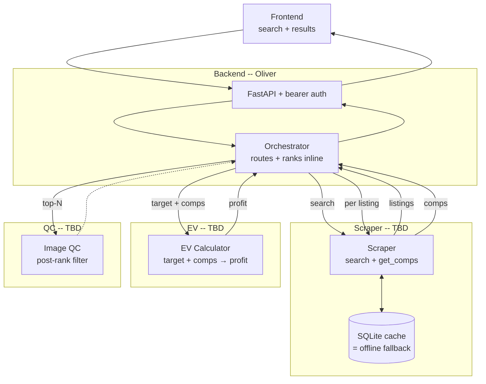

# Grailed Arbitrage — Project Spec (TENTATIVE -claude)

**Status:** draft, pending team kickoff
**Owner:** Oliver (tech lead)
**Last updated:** April 23, 2026

---

## 1. Summary

We're building an arbitrage finder for Grailed resellers. Given a search, the system returns a ranked list of active listings sorted by expected profit, where expected profit is computed from recent sold comparables plus fees, shipping, and holding costs. The primary metric is expected value (EV); the primary user is a reseller looking for underpriced inventory to flip.

Core bet: if our EV calculation is sharper than what Grailed's native browsing affords, we win. Everything else (UI, image QC, ML) exists to support that bet, not replace it.

---

## 2. Team & Ownership

Five people. Three on the core product path, two on parallel features that plug into ranking.


| Role                                      | Owner           | Branch     | Critical path?         |
| ----------------------------------------- | --------------- | ---------- | ---------------------- |
| Backend — API, orchestrator, ranker       | Oliver          | `backend`  | Yes                    |
| Scraper — Grailed search + comp retrieval | TBD             | `scraper`  | Yes                    |
| EV Calculator                             | TBD (math lead) | `ev`       | Yes                    |
| Frontend                                  | TBD             | `frontend` | Yes (demo surface)     |
| Image Quality Control                     | TBD             | `qc`       | No (ships if it ships) |


Frontend is technically a feature track but functionally critical — it is the demo. Dedicated owner, not a side project.

Two additional features were scoped and **cut for now**: description LLM analysis, and a supplementary ML model. These return only if QC ships early and the critical path is healthy.

---

## 3. Architecture




### 3.1 Scraper module

**Owner:** scraper lead. **Branch:** `scraper`.

Responsibilities:

- Search Grailed for active listings matching filters.
- Retrieve sold comparables for a given listing. Similarity heuristic lives here (baseline: category + brand + size + condition; iterate).
- SQLite cache layer. Reads-first, scrape-on-miss. Every successful scrape writes.
- Offline toggle (env var). When flipped, module returns cache-only results with the same interface. This is our fallback if Grailed blocks us.

Exposes: `search(filters)` and `get_comps(listing)`. Exact shapes locked at contract sync (see §4).

Dependencies: none. Can develop against real Grailed from hour 1.

### 3.2 EV Calculator module

**Owner:** math lead. **Branch:** `ev`.

Responsibilities:

- Given a target listing and a set of comps, produce an expected profit metric (point estimate or distribution — owner's call).
- Deterministic cost math (Grailed fees, shipping, holding) lives either here or in the orchestrator. Owner picks based on cleanliness.
- Pure function: no I/O, no state. Trivially unit-testable.

Exposes: one method, `target + comps → profit metric`. Shape locked at contract sync.

Dependencies: none for development. Works against stub comps from hour 1, unblocked regardless of scraper status.

### 3.3 Backend module (API + Orchestrator + Ranker)

**Owner:** Oliver. **Branch:** `backend`.

Responsibilities:

- FastAPI server, bearer auth, single API key, one primary endpoint (search → ranked results).
- Orchestrator routes each request: scraper → for each listing, fetch comps → EV per listing → sort by profit → return top-N.
- Ranker is an inline function, not a class. Sort + threshold + optional QC filter.
- Concurrency: fan out comp fetches and EV calls in parallel per listing.
- Hook points for features: QC sits post-EV, pre-response. Future LLM/ML hooks follow the same pattern.

Exposes: HTTP endpoint to frontend. Internal contract with scraper and EV modules.

Dependencies: stubs both scraper and EV from hour 1. Integrates real modules as contracts lock.

### 3.4 Frontend module

**Owner:** frontend lead. **Branch:** `frontend`.

Responsibilities:

- Search input, filters mirroring Grailed's native filters, ranked results view.
- Visual hierarchy around expected profit. Target price, expected sale price, expected profit, confidence indicator.
- Demo polish: empty states, loading states, at least one hero demo query pre-loaded and visually tight.
- Framework choice is owner's call — whatever ships fastest. Next.js default, plain React if simpler.

Exposes: consumes the backend API.

Dependencies: stubbed API response from hour 1. Integrates against real backend as soon as the endpoint is live.

### 3.5 Image Quality Control module

**Owner:** QC lead. **Branch:** `qc`.

Responsibilities:

- Score listing images (condition, photo quality, authenticity signals — scope owner's call).
- Called only on the top-N results post-EV, so compute stays bounded.
- Score feeds ranker as either a filter or a multiplier.

Exposes: `score(listing)` returning a numeric score. Must be optional — orchestrator runs correctly without it.

Dependencies: needs listing data with image URLs. Can develop against static sample listings from hour 1.

---

## 4. Integration Contracts

Three interface contracts gate the full pipeline. They are intentionally unlocked at the time of this spec — we lock them together at the **contract sync** (see §5, hour 2).

1. **Listing shape** — what the scraper returns, what EV and QC consume.
2. **Comp set shape** — what scraper returns from `get_comps`, what EV consumes.
3. **Ranked result shape** — what the backend returns to the frontend.

Until locked, every module stubs its side with fakes that match the owner's working assumption. Stubs get replaced with real calls as each contract lands.

---

## 5. Repo & Workflow

### 5.1 Repo structure

Monorepo, one GitHub repo. Rough layout:

```
/
├── README.md              (setup, run instructions)
├── SPEC.md                (this doc)
├── docs/                  (design notes, ADRs, contract proposals)
├── backend/               (API, orchestrator, ranker)
├── scraper/               (Grailed client + cache)
├── ev/                    (EV calculator)
├── frontend/              (client app)
├── qc/                    (image QC)
└── shared/                (types, contracts once locked)
```

Each module is a standalone package with its own tests. `shared/` holds the locked contract definitions once we agree on them.

### 5.2 Branching

- One long-lived branch per owner, named by module (`backend`, `scraper`, `ev`, `frontend`, `qc`).
- `main` is the integration branch. It stays green end-to-end from hour 2 onward (stubs are fine; it must run).
- Rebase off `main` every few hours, not end-of-day. Small conflicts, not big ones.
- Merge to `main` the moment your module is runnable in isolation with a stub interface. Even if it's just scaffolding.

### 5.3 Merging

- PRs encouraged but not required — we're optimizing for speed. If you merge direct to `main`, ping the team.
- A merge must not break the end-to-end run. If it does, revert immediately.
- Mergers into `main` are responsible for checking `main` still runs.

### 5.4 Integration

- **The API is the integration harness.** From hour 2, `main` has a runnable backend serving the primary endpoint — with stubs filling in for unfinished modules. Every merge proves the pipe works.
- **No big-bang integration night before the demo.** Historically kills hackathon projects. If integration is happening in the last 4 hours, we have already failed — the spec is designed to front-load it.

### 5.5 Communication

- **Kickoff** (hour 0): walk this spec, assign names to roles, set up repo, open branches.
- **Contract sync** (hour 2): 30 min, whole team. Lock the three contracts in §4. After this sync, interface breakage is a bug, not a negotiation.
- **Check-ins** every ~4 hours, 10 min max: blockers, merges, anything that affects someone else.
- **Async channel** (Slack/Discord/whatever the team uses): blockers flagged immediately, not saved for standup.
- **Math pairing:** Oliver pairs with the EV owner every few hours, ad hoc. Math is the biggest bus-factor risk; we reduce it by keeping the interface surface small and checked often.

### 5.6 Docs

- `SPEC.md` (this file) — top-level, updated as scope changes.
- `README.md` — setup and run, owned by Oliver, updated by anyone whose module needs new setup steps.
- `docs/contracts/` — contract proposals pre-lock, final shapes post-lock.
- `docs/decisions/` — short ADRs for non-obvious choices (framework picks, model choices, etc.). One file per decision, dated, author credited. Keep them short — a paragraph of context, the decision, the alternatives rejected.
- Module-level READMEs inside each module folder, owned by that module's lead.

Rule of thumb: if a decision affects someone else's module, it gets a note in `docs/`. If it's internal to your module, a comment in code is enough.

---

## 6. Timeline shape

Not hour-by-hour — phase-level. Adjust based on actual hackathon duration.

- **Phase 0 (kickoff, ~1hr):** spec walk, assignments, repo setup, branches open.
- **Phase 1 (contract lock, ~1hr):** stub each module enough to serve fakes. Lock contracts. Main runs end-to-end.
- **Phase 2 (build, bulk of time):** real modules replace stubs. Integration happens continuously. Check-ins every 4hr.
- **Phase 3 (T-6hr):** first full demo rehearsal on real Grailed data. Surface bugs, fix.
- **Phase 4 (T-3hr):** polish only. No new features. Frontend owner runs point.
- **Phase 5 (T-1hr):** hands off code. Practice the pitch. Locked demo query ready.

---

## 7. Risks

- **Grailed blocks our scraper.** Mitigation: cache-first design + offline fallback built into the scraper module from day one.
- **Comp similarity quality.** Bad comps → bad EV → bad ranking → bad demo. Mitigation: scraper lead and math lead align in hour 1 on what "similar" means. Iterate if the baseline is weak.
- **Grailed sold-data semantics.** "Sold" vs "delisted" matters. Scraper lead confirms the data model in hour 1 before building comp retrieval.
- **EV bus factor.** One math owner. Mitigation: small, pure-function interface; Oliver pairs often; EV is testable in isolation with stubs.
- **Concurrency in orchestrator.** Serial comp fetches for 20 listings will feel slow. Mitigation: async fan-out baked into the orchestrator from day one.
- **Scope creep from cut features.** Description LLM and ML model are cut. If someone wants to add them, they must ship their primary deliverable first.

---

## 8. Open items

Needs resolution at kickoff:

- Names assigned to each role
- Hackathon total duration (calibrates the timeline in §6)
- Shared comms channel
- Hosting for demo (localhost OK? need a deployed URL?)
- Single API key creation + where it lives (env var, `.env` gitignored)

---

## 9. What this spec is not

- Not a set of locked data models. Contracts are in §4 and get locked at the sync, not here.
- Not a detailed task breakdown. Each owner decomposes their module themselves.
- Not final on features. QC might get cut if it stalls; description LLM and ML might get added if we ship early. The priority stack in §2 governs.

